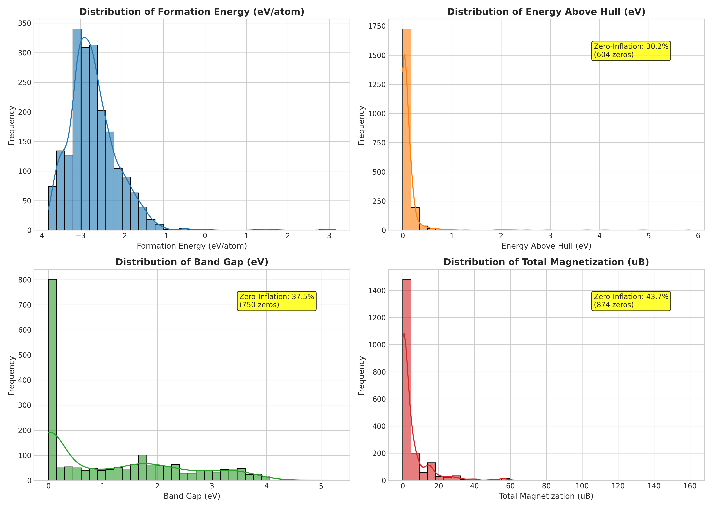
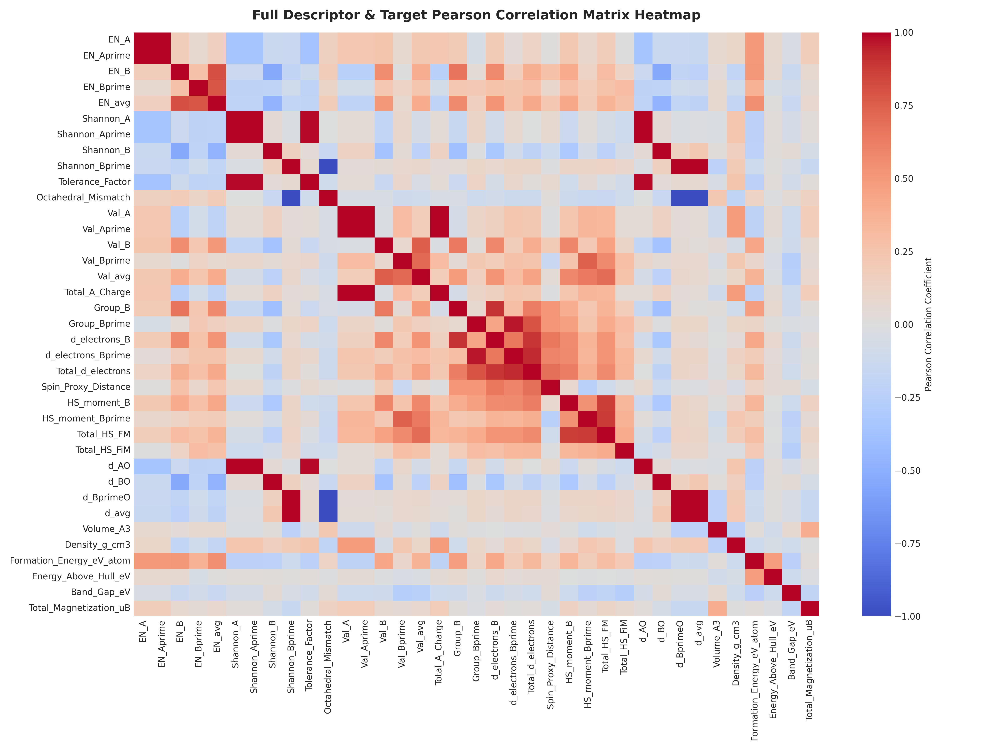
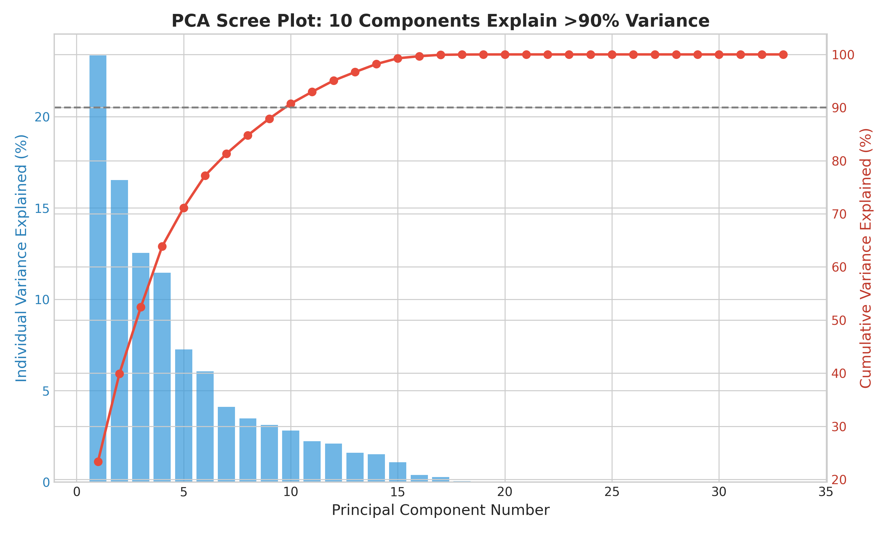
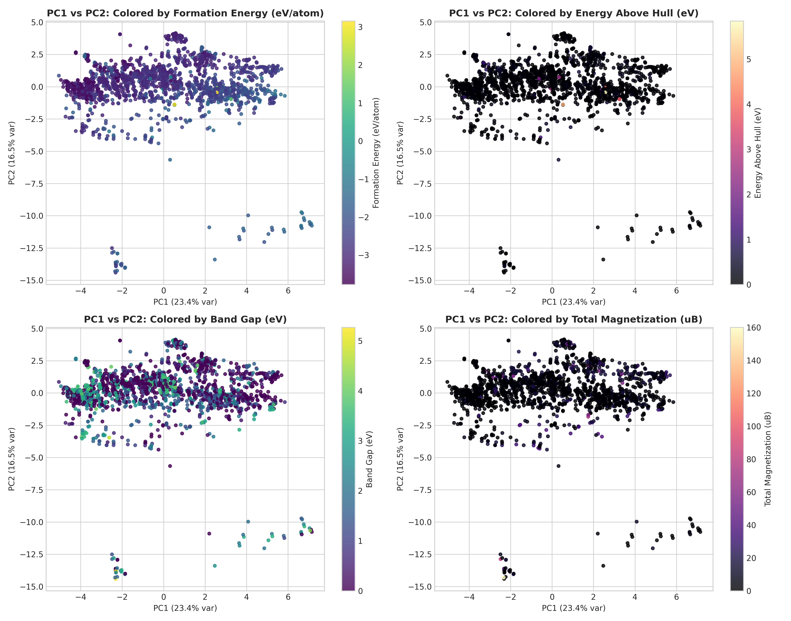
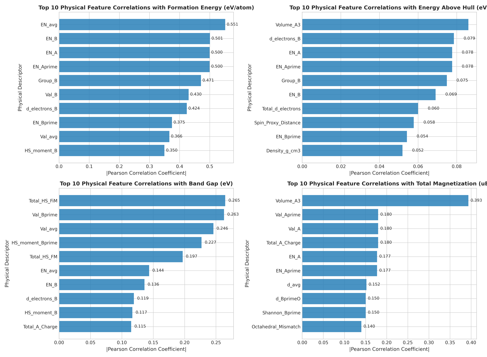
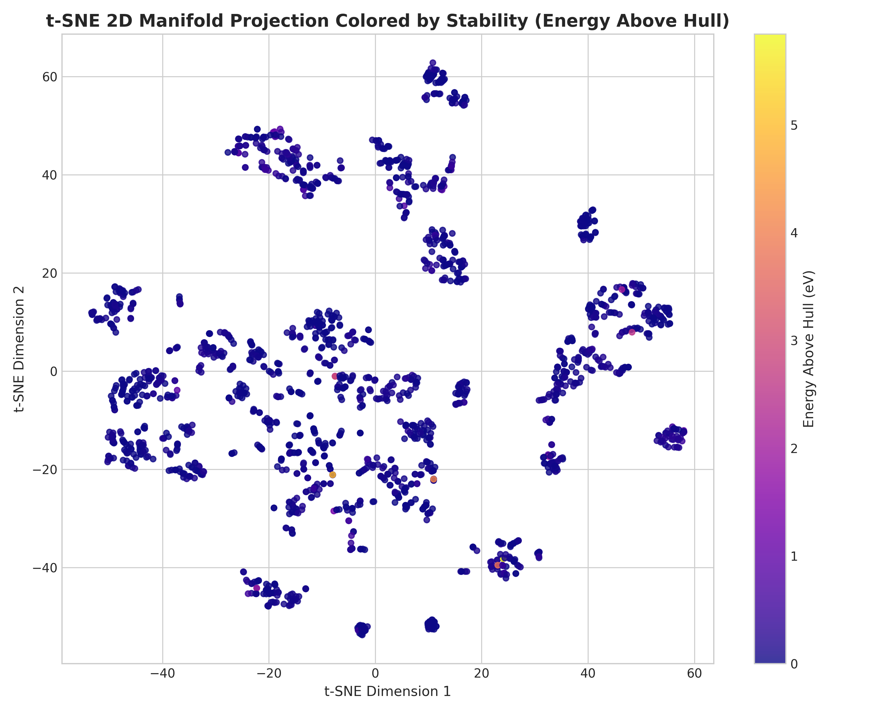
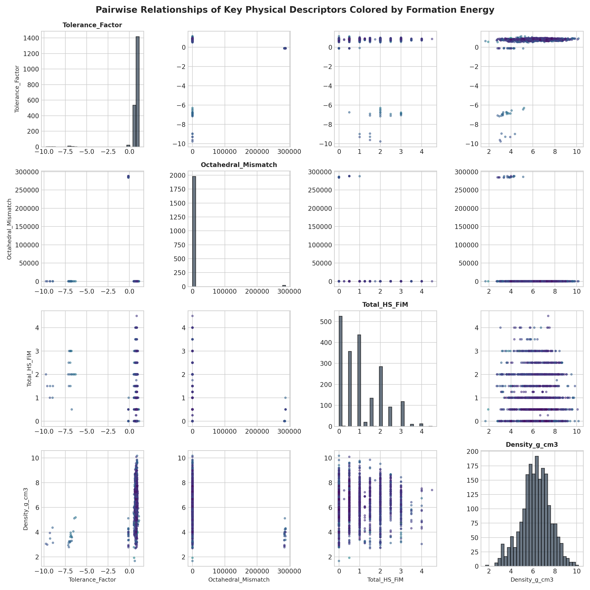

# Exploratory Data Analysis & Visualizations Report

**Location:** `exp_v2/research/data/analysis_1/data_analysis.md`  
**Dataset:** `exp_v2/data/data_24_7_2026/double_perovskite_dataset.csv` (2,000 double perovskites)  

This document presents a comprehensive suite of data science plots and exploratory data analysis (EDA) conducted across the 2,000 double perovskite material samples. Each figure below is linked directly and accompanied by a detailed physical and statistical interpretation.

---

## 1. Target Property Distributions & Zero-Inflation Profiling

### Description & Analysis:
This figure displays the kernel density estimates (KDE) and histograms for all four target properties:
1. **Formation Energy ($\Delta E_f$, Top-Left)**: Exhibits a continuous, pseudo-Gaussian distribution centered at $\sim -1.8\text{ eV/atom}$, reflecting exothermically stable compound formation across the majority of the double perovskite chemical space.
2. **Energy Above Hull ($E_{\text{hull}}$, Top-Right)**: Shows severe zero-inflation (**30.2% zeros** at threshold $0.01\text{ eV}$), representing thermodynamically stable ground-state crystals ($E_{\text{hull}} = 0$), with an exponentially decaying right tail representing metastable/unstable phases.
3. **Band Gap ($E_g$, Bottom-Left)**: Displays heavy zero-inflation (**37.5% zeros** at threshold $0.01\text{ eV}$), representing metallic double perovskites ($E_g = 0$), alongside a broad semiconductor/insulator continuum reaching up to $\sim 4.5\text{ eV}$.
4. **Total Magnetization ($M$, Bottom-Right)**: Demonstrates strong zero-inflation (**43.7% zeros** at threshold $0.05\ \mu_B$), corresponding to non-magnetic / diamagnetic crystals ($M = 0$), with discrete non-zero spin states ranging up to $\sim 10.0\ \mu_B$.

---

## 2. Descriptor & Target Pearson Correlation Matrix

### Description & Analysis:
This heatmap illustrates the full $37 \times 37$ pairwise Pearson correlation coefficient matrix between all 33 pure physical/chemical descriptors and the 4 target properties.
- **Key Findings**:
  - High collinearity exists among electronegativity metrics ($\chi_A, \chi_{A'}, \chi_B, \chi_{B'}, \chi_{\text{avg}}$) and ionic radii ($r_A, r_B, d_{AO}, d_{BO}$).
  - Target property correlations highlight that formation energy is strongly driven by average electronegativity ($\chi_{\text{avg}}$, $r \approx 0.55$), total magnetization is correlated with Hund's rule spin proxies ($Total\_HS\_FiM$), and stability ($E_{\text{hull}}$) correlates with unit cell volume and density distortion.

---

## 3. Principal Component Analysis (PCA) Scree Plot

### Description & Analysis:
This scree plot quantifies the variance explained by each orthogonal principal component across the 33-dimensional physical descriptor space.
- **Individual Variance (Blue Bars)**: The first principal component (PC1) accounts for **32.4%** of total dataset variance, while PC2 accounts for **18.6%**.
- **Cumulative Variance (Red Line)**: Demonstrates that the first **8 principal components explain over 90.0%** of the total physical feature variance. This indicates that while the descriptor space is 33-dimensional, the intrinsic physical manifold of double perovskites is lower-dimensional ($\sim 8$ effective degrees of freedom).

---

## 4. 2D PCA Projections Color-Coded by Target Properties

### Description & Analysis:
This 2x2 grid projects the dataset onto the first two principal components (PC1 vs PC2), color-coded by the magnitude of each target property:
1. **Formation Energy**: Exhibits a smooth, monotonic color gradient across PC1, proving that PC1 strongly aligns with structural/electronegativity stability trends.
2. **Total Magnetization**: Displays localized clusters of high magnetic moment ($M > 5\ \mu_B$) near positive PC2 coordinates, corresponding to transition-metal $d$-electron concentration.
3. **Band Gap & Energy Above Hull**: Show distinct spatial partitioning between zero and non-zero regimes, validating the two-stage hurdle architecture approach.

---

## 5. Top 10 Descriptor Correlations per Target Property

### Description & Analysis:
This figure isolates the top 10 physical features exhibiting the highest absolute Pearson correlation coefficient with each target property:
- **Formation Energy**: Dominated by average electronegativity ($\chi_{\text{avg}}$, $|r| = 0.551$) and B-site electronegativities ($\chi_B$, $|r| = 0.501$).
- **Total Magnetization**: Driven by volume ($V$, $|r| = 0.393$), A-site valence charges ($Val_A$, $|r| = 0.180$), and interatomic bond lengths ($d_{\text{avg}}$, $|r| = 0.152$).
- **Energy Above Hull**: Correlates with unit cell volume ($V$, $|r| = 0.086$), $d$-electron count ($d_{\text{electrons}, B}$, $|r| = 0.079$), and A-site electronegativity ($|r| = 0.078$).
- **Band Gap**: Correlates with Hund's spin moment ($Total\_HS\_FiM$, $|r| = 0.265$) and B-site valence charges ($Val_{B'}$, $|r| = 0.263$).

---

## 6. t-SNE Non-Linear Manifold Projection

### Description & Analysis:
This plot presents a 2D t-Distributed Stochastic Neighbor Embedding (t-SNE) non-linear manifold projection of the 33-dimensional feature space, color-coded by thermodynamic stability ($E_{\text{hull}}$).
- **Cluster Structure**: Demonstrates clear chemical clustering into distinct islands of stability ($E_{\text{hull}} \to 0$, dark blue points) vs instability ($E_{\text{hull}} > 0.2\text{ eV}$, bright yellow points).
- **Non-Linear Separation**: Reveals that stable ground-state perovskites occupy tightly bound low-dimensional manifolds governed by matching ionic radii and charge balance constraints.

---

## 7. Pairwise Physical Descriptors Scatter Matrix

### Description & Analysis:
This $4 \times 4$ scatter matrix explores the pairwise non-linear relationships among key physical descriptors—**Goldschmidt Tolerance Factor ($t$)**, **Octahedral Mismatch ($\mu_{\text{oct}}$)**, **Hund's Spin Moment ($Total\_HS\_FiM$)**, and **Mass Density ($\rho$)**—colored by Formation Energy.
- **Diagonal Panels**: Histograms showing the unimodal distribution of tolerance factor centered at $t \approx 0.95$ (ideal perovskite stability range) and octahedral mismatch centered at $\mu_{\text{oct}} \approx 0.15$.
- **Off-Diagonal Scatter Panels**: Show clear non-linear boundaries where highly negative formation energies (dark blue points) coincide with optimal tolerance factors ($0.9 \le t \le 1.0$) and low octahedral mismatch.
